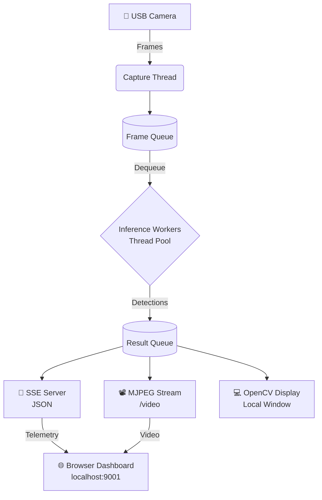
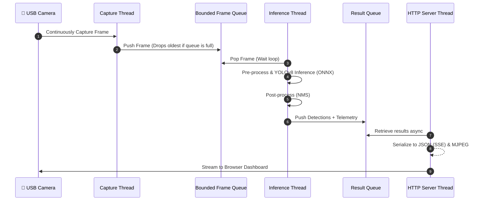
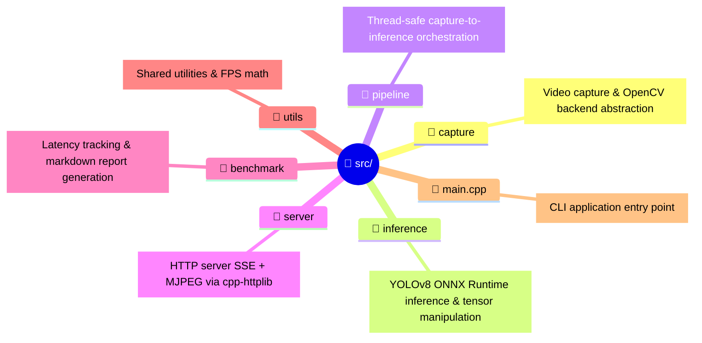

<div align="center">
  <h1>🚀 Real-time AI Video Analytics Pipeline</h1>
  <p><i>A production-grade C++ pipeline for YOLOv8 object detection with ONNX Runtime</i></p>

  <p>
    <a href="https://github.com/microsoft/onnxruntime"></a>
    <a href="https://opencv.org/"></a>
    <a href="https://isocpp.org/"></a>
    <a href="https://cmake.org/"></a>
    <a href="https://www.docker.com/"></a>
    <a href="LICENSE"></a>
  </p>
</div>

---

<br/>

## 🌟 Overview

This project is a high-performance, production-ready C++ pipeline designed for real-time video analytics. It captures video frames from a USB camera, processes them using **YOLOv8** object detection powered by **ONNX Runtime**, and streams the live results directly to a browser-based dashboard via HTTP Server-Sent Events (SSE) and MJPEG streams.

### ✨ Key Features
- **Concurrent Threading Model**: Independent threads for capture, inference, and HTTP serving ensure unblocking execution.
- **Thread-Safe inference**: Each inference thread securely owns its ONNX Runtime session.
- **Efficient Memory Management**: Utilizes lock-free, bounded queues with a drop-oldest strategy to prevent memory growth under heavy workloads.
- **Interactive Dashboard Integration**: Transmits JSON telemetry via Server-Sent Events (SSE) alongside a low-latency MJPEG video stream.

---

## 🏗️ Architecture

The pipeline follows a highly decoupled and multi-threaded architecture to maximize throughput and minimize latency. 



### 🔄 Concurrent Threading Sequence



---

## 🚀 Quick Start

### 🐳 Using Docker (Recommended)

Get the pipeline running in seconds without installing local dependencies:

```bash
docker build -t video-analytics .
docker run --rm --device /dev/video0 -p 9001:9001 video-analytics
```

### 🛠️ Manual Build Strategy

If you prefer building from source natively:

<details>
<summary><b>📋 View Prerequisites & Dependencies Setup</b></summary>

**Requirements:** Ubuntu 22.04+, CMake 3.20+, GCC 11+

**1. Install OpenCV:**
```bash
sudo apt install libopencv-dev
```

**2. Install ONNX Runtime 1.17.0:**
```bash
wget https://github.com/microsoft/onnxruntime/releases/download/v1.17.0/onnxruntime-linux-x64-1.17.0.tgz
tar xzf onnxruntime-linux-x64-1.17.0.tgz
sudo cp onnxruntime-linux-x64-1.17.0/lib/* /usr/local/lib/
sudo cp -r onnxruntime-linux-x64-1.17.0/include/* /usr/local/include/
sudo ldconfig
```

**3. Prepare YOLOv8n ONNX Model:**
```bash
pip install ultralytics
yolo export model=yolov8n.pt format=onnx
mkdir -p models && mv yolov8n.onnx models/
```
</details>

**Build and Run:**
```bash
# Configure and Build
cmake -B build -DCMAKE_BUILD_TYPE=Release
cmake --build build --parallel $(nproc)

# Execute
build/src/video_analytics --device 0
```

> **Note:** Open your browser and navigate to [http://localhost:9001](http://localhost:9001) to view the live dashboard!

---

## 💻 CLI Usage

The executable provides multiple arguments for fine-tuning performance and operation modes.

```text
video_analytics [OPTIONS]                  Live camera mode
video_analytics --benchmark OPTIONS        Benchmark mode
```

### General Options
| Flag | Description | Default |
|------|-------------|---------|
| `--device N` | Camera USB device index | `0` |
| `--model PATH`| Path to `.onnx` model file | `models/yolov8n.onnx` |
| `--port N` | HTTP Dashboard port | `9001` |
| `--bind ADDR` | Server bind IPv4 address | `127.0.0.1` |
| `--workers N` | Number of ONNX inference threads | `2` |

### Benchmark Options
| Flag | Description | Default |
|------|-------------|---------|
| `--input FILE` | Input video file to evaluate | *(required)* |
| `--frames N` | Limit inference to exactly N frames | `300` |
| `--output FILE`| Log evaluation path report | *(none)* |

### 💡 Examples
```bash
# Run with customized camera and worker count
build/src/video_analytics --device 2 --bind 0.0.0.0 --port 8080 --workers 4

# Run profiling benchmark
build/src/video_analytics --benchmark --input test.avi --frames 500 --output report.md
```

---

## 📊 Performance Benchmarks

*Tested on: Intel CPU, 2 Inference Workers, YOLOv8n (640x640).*

| Metric | Target Value |
|--------|-------|
| **Throughput** | ~25-33 FPS |
| **Inference latency** | ~35 ms / frame |
| **Model Size** | 12.3 MB (FP32) |

> 🔥 **Optimization Trick:** FP16 quantization is available via `scripts/quantize-fp16.py`, reducing the model size to **6.2 MB** (-50%). Requires `onnxruntime-gpu` with the CUDA execution provider for runtime support.

---

## 📂 Project Structure



---

## 🧪 Testing

The codebase includes a comprehensive test suite to ensure stability across core components like queueing, thread locking, serialization, and latency maths.

```bash
# Execute Test Binaries
build/tests/test_pipeline         # Tests BoundedQueue, FrameData, Threading
build/tests/test_inference        # ONNX model loading & execution tests
build/tests/test_serializer       # SSE/JSON payload validation
build/tests/test_latency_tracker  # P50/P95/P99 math checks
```

<details>
<summary><b>🛠 Address/Thread Sanitizers Build</b></summary>

Catch memory leaks or race conditions by enabling compiler sanitizers:
```bash
cmake -B build -DENABLE_TSAN=ON   # ThreadSanitizer
cmake -B build -DENABLE_ASAN=ON   # AddressSanitizer
```
</details>

---

## 📚 References & Resources

- 🏗️ [**Architecture Deep-Dive**](docs/ARCHITECTURE.md) — Threading models, data lifecycle, queue mechanics.
- 👨‍💻 [**Development Guide**](docs/DEVELOPMENT.md) — Tooling, advanced prerequisites, application profiling.

## 📦 Core Dependencies

| Library | Version | Purpose |
|---------|---------|---------|
| **[OpenCV](https://opencv.org/)** | `>= 4.6` | Video capture, image processing |
| **[ONNX Runtime](https://nxruntime.ai/)** | `>= 1.17` | YOLOv8 inference (C++ API) |
| **[nlohmann/json](https://github.com/nlohmann/json)** | `3.11.3` | JSON serialization (fetched by CMake) |
| **[cpp-httplib](https://github.com/yhirose/cpp-httplib)** | `0.18.7` | HTTP/SSE/MJPEG server (fetched by CMake) |

<br/>

<div align="center">
  <i>Developed with ❤️ for high-performance C++ engineering.</i><br>
  <!--- Feel free to add a screenshot or GIF here showcasing your dashboard! --->
  <!---  --->
</div>
