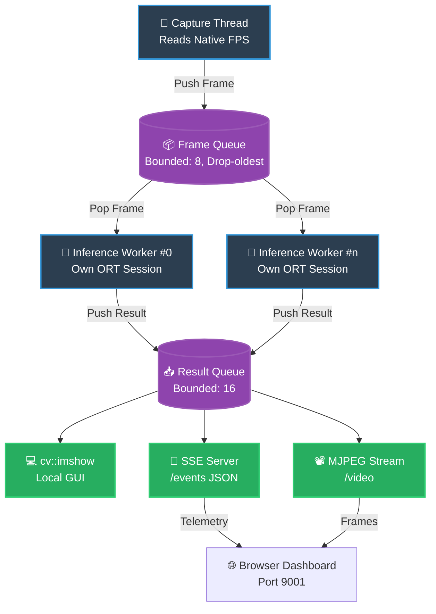
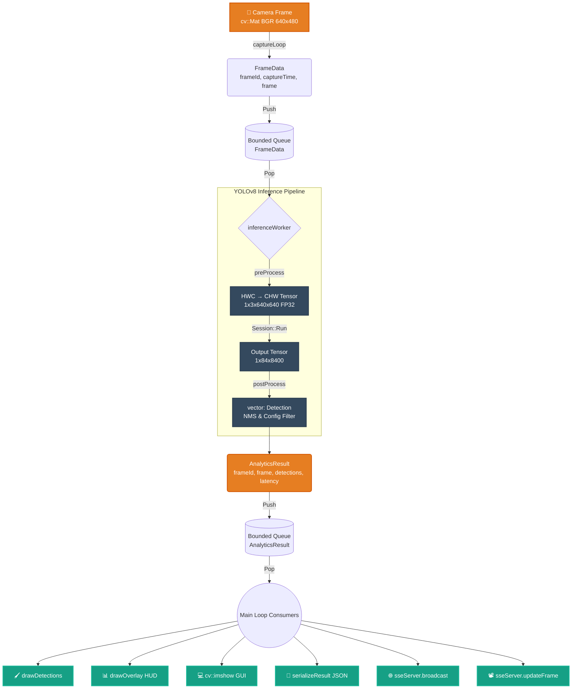

# 🏗️ System Architecture

This document details the internal design of the Real-time Video Analytics pipeline, focusing on its threading model, data lifecycle, and memory management strategies.

## 🔄 Thread Design

The system relies on a strictly decoupled, multi-threaded architecture to ensure that slow operations (like inference or network IO) do not block high-frequency operations (like camera capture).



### 📋 Thread Responsibilities

| Thread | Owner Method | Primary Purpose |
|--------|-------|---------|
| 🎥 **Capture** | `Pipeline::captureLoop()` | Reads frames from camera/video, pushes `FrameData` to the frame queue. Operates completely unblocked. |
| 🧠 **Inference Worker(s)** | `Pipeline::inferenceWorker(N)` | Pops frames, executes YOLOv8 detection using ONNX, pushes `AnalyticsResult`. |
| 🌐 **HTTP Server** | `SseServer::httpThread_` | Serves static files, manages SSE connections, and pushes the MJPEG stream asynchronously. |
| 🖥️ **Main** | `main()` | Consumes results, draws overlays, broadcasts to SSE, and orchestrates shutdown. |

> [!NOTE]
> **Why Session-per-Worker?**  
> While ONNX Runtime sessions are technically thread-safe, concurrent `Run()` calls on a single session serialize internally. Providing each worker with its own dedicated session guarantees true parallelism.

---

## 🌊 Data Flow Lifecycle

The data traverses a strict pipeline from raw pixels to actionable network telemetry.



---

## 📦 Buffer Management Strategy

### The `BoundedQueue` Wrapper

The core of our fast orchestration is a thread-safe queue featuring a configurable maximum size. When full, it **drops the oldest item** to create room for new inward traffic. 

> [!IMPORTANT]
> **Why Drop Oldest?**
> - **Bounded Memory:** Prevents unbounded memory growth during producer/consumer speed mismatch events.
> - **Real-Time Priority:** The system favors *low latency* (displaying the absolute newest frame) over *completeness* (processing every single frame in a backlog).
> - **Unblocked Producers:** The capture thread never stalls waiting for the inference engine.

```cpp
// 🚀 Producer side (Never blocks!)
queue.push(item);  // Quietly evicts oldest item if full

// 🛑 Consumer side (Blocks efficiently)
auto item = queue.pop();                 // Blocking wait
auto item = queue.tryPopFor(timeout_ms); // Timed wait
```

### ⚙️ Queue Sizing Table

| Queue | Default Size | Rationale |
|-------|:---:|-----------|
| 📥 **Frame Queue** | `8` | A deliberately tiny buffer between capture and inference ensures only the latest frames enter processing. |
| 📤 **Result Queue** | `16` | A slightly larger buffer to absorb timing jitter between fast inference completions and slower SSE network flushes. |
| 📊 **Benchmark Mode** | `maxFrames + 10` | Disables dropping. Forces the pipeline to process and evaluate *every* frame for accurate benchmarking. |

---

## 🛡️ Error Handling Mechanisms

Fault tolerance is built deeply into the loops to ensure system resilience gracefully.

| Scenario | System Behavior |
|----------|-----------------|
| 🔌 **Camera Disconnect** | `30` consecutive read failures → pipeline halts intelligently. |
| 🎬 **Video File EOF** | Capture thread exits naturally → frame queue stops → inference threads drain remaining frames before exiting. |
| 💥 **Model Load Failure** | The pipeline refuses startup instantly and propagates the unrecoverable error. |
| 🛑 **SIGINT / SIGTERM** (Ctrl+C) | Global atomic flag `Pipeline::stop()` is triggered. All thread loops exit their wait states gracefully without segfaults. |

---

## 📡 HTTP Server Routes (cpp-httplib)

The embedded lightweight HTTP server (`cpp-httplib`) exposes the following topology:

| Route Path | Content Type | Operational Description |
|-------|:---:|-------------|
| 🏠 `/` | Static HTML | Serves the interactive Dashboard HTML page. |
| ⚡ `/events` | `text/event-stream` (SSE) | Server-Sent Events stream delivering continuous JSON telemetry and detection coordinates. |
| 🎞️ `/video` | `multipart/x-mixed-replace` | Boundary-separated MJPEG stream carrying the real-time annotated video frames. |
| 🎨 `/app.js`, `/app.css` | Static Assets | Serves compiled styling and JavaScript engine for the dashboard. |
